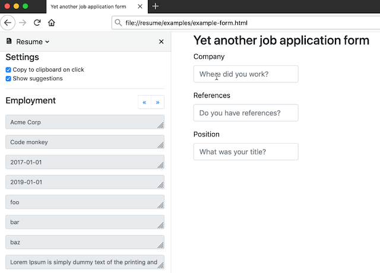

# Resume

Tired of having resume stored in different places and formats? Store it in one place: a human readable `yaml` and use it to generate a `LaTeX` pdf or populate web forms with a help of browser extension. 

## Integrations

### `cargo run -- tex`

Outputs a `output.tex` file that renders into the below pdf based on example data in [`examples/resume.yaml`](examples/resume.yaml).

**Notes**

1. [`tectonic`](https://github.com/tectonic-typesetting/tectonic/) isn't used due to its external dependencies, render the output to pdf with locally installed `XeLaTeX`. Plain `LaTeX` won't work due to custom font usage.
1. The fonts used are located in `examples/fonts` directory and licensed under [`SIL Open Font License`](examples/fonts/SIL%20Open%20Font%20License.txt).
1. A similar project is [`pyresume`](https://github.com/waynr/pyresume).

### `cargo run -- browser-extension`

Generates a web browser extension with the employment and education fields of the resume. The extension is a panel shown on the left side below. The fields are copied to clipboard on click for convenience and suggestions are shown if possible.

**Notes**

1. **Read the user agreement and all terms and conditions of the website before using this extension.** Some popular professional networks have explicit clauses that disallow using tools to interact with their websites.
1. Currently only Firefox is supported. 
1. The suggestions aren't 100% correct.
