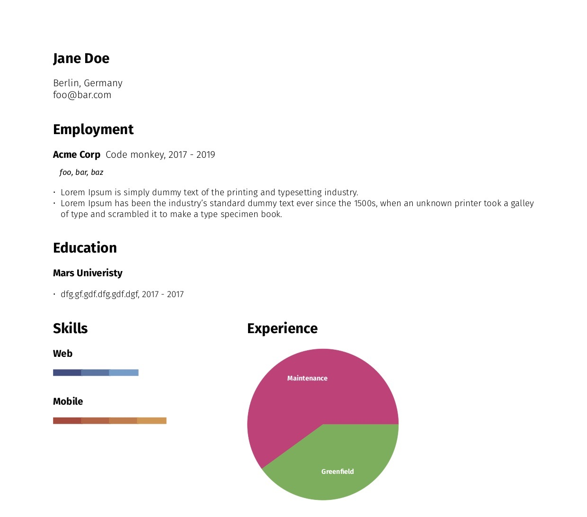

# Resume

This is not a serious project, more of a `Rust` exercise. The goal is to have a resume structured in a human readable `yaml` and use it to populate `TeX` or social networks. A similar project is [`pyresume`](https://github.com/waynr/pyresume).

## Current integrations

### `cargo run tex`

Outputs a `output.tex` file that renders to the below pdf based on the data in [`examples/resume.yaml`](examples/resume.yaml). The fonts used are located in `examples/fonts` directory and licensed under [`SIL Open Font License`](examples/fonts/SIL%20Open%20Font%20License.txt).

Didn't use [`tectonic`](https://github.com/tectonic-typesetting/tectonic/) due to its external dependencies, render the output with local `XeLaTeX` due to custom font usage.
